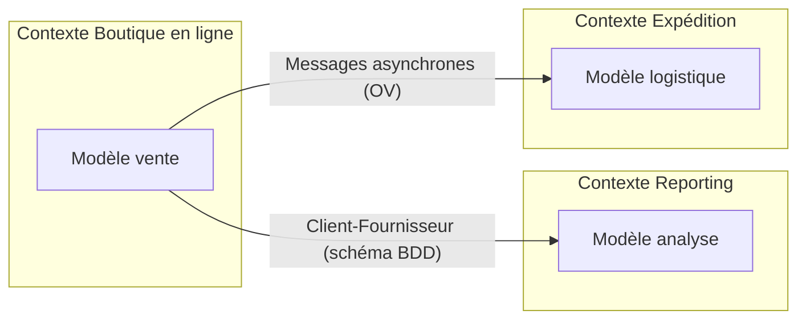

# DDD Stratégique — Contextes, intégration, distillation

Référence pour le mode Guide (découpage, intégration, priorités) et le mode Audit
(section Symptômes).

## Sommaire
1. Langage omniprésent
2. Contexte borné
3. Carte de contexte
4. Patterns de relation entre contextes (+ arbre de choix)
5. Distillation : Cœur de domaine et Sous-domaines génériques
6. Symptômes d'audit stratégiques

---

## 1. Langage omniprésent (Ubiquitous Language)

Langage commun bâti **sur le modèle**, utilisé partout : oral, écrit, diagrammes, code.
- Un changement dans le langage EST un changement dans le modèle (et inversement).
- Les experts métier doivent rejeter les termes maladroits ; les développeurs doivent
  traquer ambiguïtés et incohérences.
- Diagnostics : la « traduction » permanente en réunion est le signal d'échec n° 1 ;
  les concepts qui n'existent qu'à l'oral et jamais dans le code sont des concepts perdus.
- Préférer plusieurs petits diagrammes + texte à un méga-diagramme illisible ; les longs
  documents désynchronisés du modèle sont nuisibles.

## 2. Contexte borné (Bounded Context)

Périmètre explicite (équipe, parties de l'application, bases de code, schémas de BDD) dans
lequel un modèle est strictement cohérent et unifié.

- Un gros modèle d'entreprise unifié est un idéal qui s'effondre : **diviser sciemment**.
- Taille : assignable à une seule équipe ; les éléments liés formant un concept naturel
  vont ensemble.
- Un Contexte borné N'EST PAS un Module : le contexte englobe les modules.
- Chaque contexte porte un nom, qui entre dans le Langage omniprésent.
- À l'intérieur d'un contexte : **Intégration continue** (fusion fréquente, build, tests
  automatisés) pour empêcher la fragmentation du modèle.

## 3. Carte de contexte (Context Map)

Document (diagramme ou texte) montrant tous les Contextes bornés et leurs relations, y
compris les mappages de traduction. Partagée et comprise par tous.

En Mermaid, format recommandé pour la restitution d'audit :



## 4. Patterns de relation entre contextes

| Pattern | Quand | Coût / risque |
|---|---|---|
| **Noyau partagé** | Deux équipes proches, sous-ensemble du modèle réellement commun | Modification du noyau = consultation mutuelle, fusions fréquentes, tests des deux équipes |
| **Client-Fournisseur** | Dépendance unidirectionnelle, fournisseur motivé (idéalement même management) | Réunions de planning, tests d'acceptation d'interface automatisés côté fournisseur |
| **Conformiste** | Fournisseur non coopératif MAIS son modèle est bon | On adhère au modèle d'autrui sans pouvoir le modifier |
| **Couche anticorruption** | Système historique / externe au modèle confus ou très différent | Façades + Adaptateurs + Traducteurs ; effort d'implémentation |
| **Chemins séparés** | L'intégration coûte plus qu'elle ne rapporte | Quasi-impossible à réintégrer plus tard ; IHM portail commune au plus |
| **Service Hôte ouvert** | Un sous-système utilisé par BEAUCOUP d'autres | Protocole public cohérent ; traducteurs exceptionnels pour les besoins idiosyncratiques |

Arbre de choix (à dérouler avec l'utilisateur, une question discriminante à la fois) :

```
L'intégration apporte-t-elle une vraie valeur ?
├── NON → Chemins séparés
└── OUI
    ├── Plusieurs consommateurs du même sous-système ? → Service Hôte ouvert
    ├── Système historique / modèle externe confus ? → Couche anticorruption
    ├── Dépendance unidirectionnelle ?
    │   ├── Fournisseur coopératif (même management) ? → Client-Fournisseur
    │   └── Non coopératif, modèle bien fait ? → Conformiste
    │       └── Modèle mal fait ? → Couche anticorruption
    └── Vrai sous-ensemble commun + équipes coordonnées ? → Noyau partagé
```

Implémentation d'une Couche anticorruption : un Service (vu du client) → Façade →
Adaptateur → Traducteur(s) → système externe. Un Adaptateur par Façade, jamais un
Adaptateur fourre-tout.

## 5. Distillation

Séparer le **Cœur de domaine** (l'essentiel différenciant, le « vrai capital métier ») des
**Sous-domaines génériques** (argent/devises, routage, graphiques...).

- Le Cœur est relatif : la Route est le cœur d'un système de routage, un sous-domaine
  générique pour la surveillance aérienne (dont le cœur est la synthèse de trajectoire 4D).
- Meilleurs développeurs sur le Cœur ; sous-domaines génériques en priorité basse.
- Options pour un sous-domaine générique : solution du commerce, sous-traitance, modèle
  publié existant, implémentation maison (du moins intégré au plus intégré).
- Tout investissement hors Cœur se justifie par son bénéfice POUR le Cœur.
- Le Cœur émerge par refactorings successifs, pas d'un coup.

## 6. Symptômes d'audit stratégiques

| # | Symptôme | Indices | Gravité typique | Remédiation |
|---|---|---|---|---|
| S1 | Gros modèle unique contradictoire | Mêmes termes avec des sens différents selon les zones ; modifications d'une équipe qui cassent l'autre | Bloquant | Définir les Contextes bornés, nommer, cartographier |
| S2 | Frontières implicites | Personne ne sait dans quel contexte tel module vit ; pas de convention de nommage par contexte | Majeur | Carte de contexte + mapping contexte ↔ modules |
| S3 | Intégration sauvage | Accès direct à la BDD d'un autre contexte ; pas de couche de traduction vers le legacy | Majeur | Choisir un pattern de relation (arbre §4) ; souvent Couche anticorruption |
| S4 | Couplage de schéma BDD | Plusieurs applis sur le même schéma sans accord de gouvernance | Majeur | Relation Client-Fournisseur explicite + tests d'interface |
| S5 | Traduction permanente | Glossaires parallèles, jargon technique vs jargon métier en réunion | Majeur | (Re)construire le Langage omniprésent ; refactorer les noms |
| S6 | Cœur indiscernable | La logique différenciante mélangée au générique ; meilleurs devs sur l'infra | Majeur | Distillation : nommer le Cœur, extraire les sous-domaines génériques en modules |
| S7 | Duplication inter-équipes | Couches de traduction redondantes, efforts en double | Mineur | Noyau partagé ou Service Hôte ouvert selon le cas |
