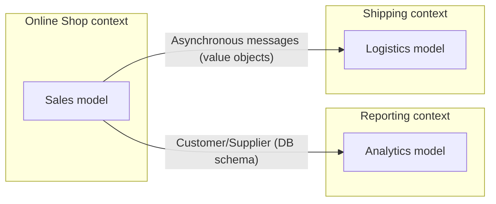

# Strategic DDD — Contexts, integration, distillation

Reference for guidance mode (splitting, integration, priorities) and for audit mode
(Symptoms section).

## Contents
1. Ubiquitous language
2. Bounded context
3. Context map
4. Relationship patterns between contexts (+ decision tree)
5. Distillation: core domain and generic subdomains
6. Strategic audit symptoms

---

## 1. Ubiquitous language

A shared language built **on the model**, used everywhere: speech, writing, diagrams, code.
- A change in the language IS a change in the model, and the other way round.
- Domain experts must reject awkward terms; developers must hunt down ambiguity and
  inconsistency.
- Diagnostics: constant "translation" in meetings is failure signal number one; concepts that
  live only in conversation and never in the code are concepts lost.
- Prefer several small diagrams plus text over one unreadable mega-diagram; long documents
  that drift out of sync with the model do harm.

## 2. Bounded context

An explicit boundary (a team, parts of the application, codebases, database schemas) within
which a model is strictly consistent and unified.

- One big unified enterprise model is an ideal that collapses: **divide deliberately**.
- Size: it must fit a single team; elements that form a natural concept together belong
  together.
- A bounded context is NOT a module: the context contains the modules.
- Every context carries a name, and that name joins the ubiquitous language.
- Inside a context: **continuous integration** (frequent merges, build, automated tests) to
  stop the model from fragmenting.

## 3. Context map

A document (diagram or text) showing every bounded context and the relationships between
them, translation mappings included. Shared with and understood by everyone.

In Mermaid, the recommended shape for an audit write-up:



## 4. Relationship patterns between contexts

| Pattern | When | Cost / risk |
|---|---|---|
| **Shared kernel** | Two teams working closely, a subset of the model genuinely in common | Changing the kernel means consulting each other, frequent merges, both teams' tests |
| **Customer/Supplier** | One-way dependency, a motivated supplier (ideally the same management) | Planning meetings, automated interface acceptance tests on the supplier side |
| **Conformist** | An uncooperative supplier BUT a good model | You adopt someone else's model with no power to change it |
| **Anti-corruption layer** | A legacy or external system whose model is confused or very different | Facades plus adapters plus translators; implementation effort |
| **Separate ways** | Integration costs more than it returns | Near impossible to reintegrate later; a shared portal UI at most |
| **Open host service** | One subsystem used by MANY others | A coherent public protocol; one-off translators for idiosyncratic needs |

Decision tree (walk it with the user, one discriminating question at a time):

```
Does integration bring real value?
├── NO → Separate ways
└── YES
    ├── Several consumers of the same subsystem? → Open host service
    ├── Legacy system / confused external model? → Anti-corruption layer
    ├── One-way dependency?
    │   ├── Cooperative supplier (same management)? → Customer/Supplier
    │   └── Uncooperative, but a well-built model? → Conformist
    │       └── A badly built model? → Anti-corruption layer
    └── A genuine common subset + coordinated teams? → Shared kernel
```

Implementing an anti-corruption layer: a service (as the client sees it) → facade → adapter →
translator(s) → the external system. One adapter per facade, never a catch-all adapter.

## 5. Distillation

Separate the **core domain** (the differentiating essence, the real business capital) from the
**generic subdomains** (money and currencies, routing, charts...).

- The core is relative: the Route is the core of a routing system and a generic subdomain for
  air traffic monitoring (whose core is 4D trajectory synthesis).
- Best developers on the core; generic subdomains are low priority.
- Options for a generic subdomain: an off-the-shelf solution, outsourcing, an existing
  published model, an in-house implementation (least integrated to most integrated).
- Every investment outside the core is justified by what it buys FOR the core.
- The core emerges through successive refactorings, not in one go.

## 6. Strategic audit symptoms

| # | Symptom | Clues | Typical severity | Remediation |
|---|---|---|---|---|
| S1 | One big contradictory model | The same terms mean different things in different areas; one team's changes break another's | Blocking | Define the bounded contexts, name them, map them |
| S2 | Implicit boundaries | Nobody knows which context a given module lives in; no per-context naming convention | Major | Context map plus a context-to-module mapping |
| S3 | Ad hoc integration | Direct access to another context's database; no translation layer towards the legacy system | Major | Pick a relationship pattern (tree in section 4); often an anti-corruption layer |
| S4 | DB schema coupling | Several applications on the same schema with no governance agreement | Major | An explicit customer/supplier relationship plus interface tests |
| S5 | Constant translation | Parallel glossaries, technical jargon against domain jargon in meetings | Major | (Re)build the ubiquitous language; refactor the names |
| S6 | Indistinguishable core | The differentiating logic mixed in with the generic; the best developers on infrastructure | Major | Distillation: name the core, extract the generic subdomains into modules |
| S7 | Duplication across teams | Redundant translation layers, duplicated effort | Minor | Shared kernel or open host service, depending on the case |
